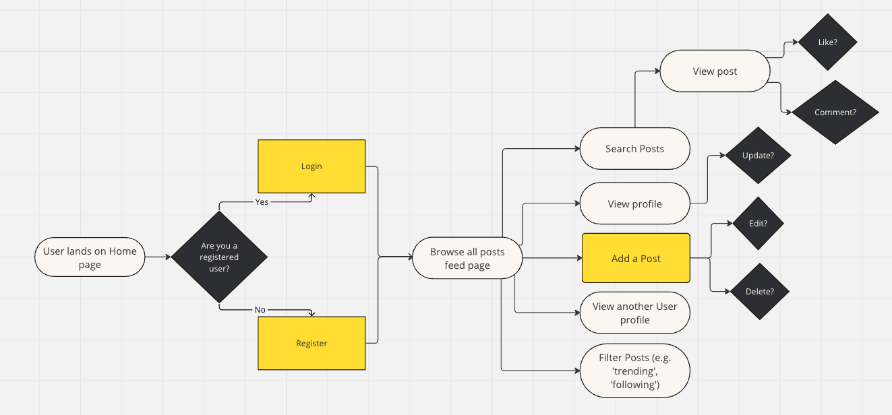
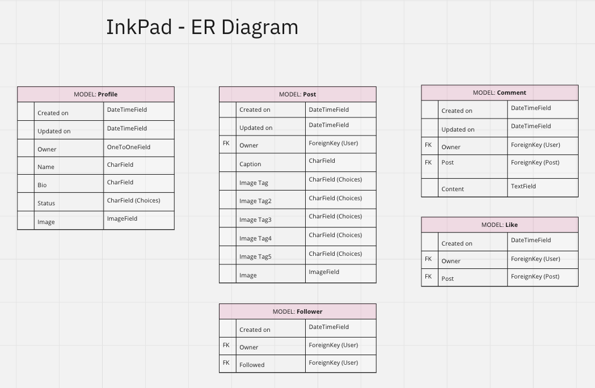
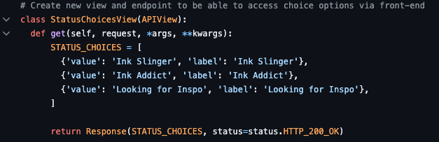
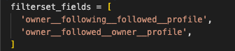
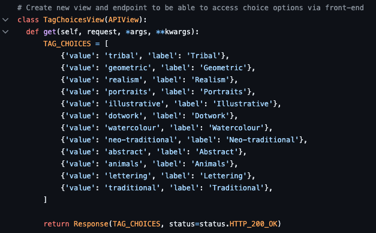
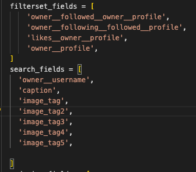

# InkPad - Back End API

InkPad is social media platform designed to share, explore and connect with a community of users. The core aim of this web application is to promote and share tattoo designs, and to connect tattoo enthusiasts, artists, and admirers alike.

Users will be able to browse and search through posts. They will be able to create their own posts, and attach tags to these to help others to find certain categories more easily. They will also be able to comment on eachothers posts, and to follow/be followed by other users.


[Visit the live website here](https://pp5-kl-c6a010106309.herokuapp.com/)

[Visit the InkPad Front End repository here](https://github.com/llewellynksj/pp5-kl)

### Back-End API

This repository is for the back end API for this project, and was created using Django REST Framework:

[Visit the InkPad Live API here](https://pp5-api-kl-a5aee8435a6f.herokuapp.com/)

<br>

## Contents
----

### [User Stories](#user-stories-1)

### [Database](#database-1)

### [Project Structure](#project-structure-1)
- [Apps](#apps)
  - [Profiles](#profiles)
  - [Posts](#posts)
  - [Comments](#comments)
  - [Likes](#likes)
  - [Followers](#followers)

### [Technologies](#technologies-1)

### [Version Control](#version-control-1)

### [Deployment](#deployment-1)

### [Testing](#testing-1)

### [Credits](#credits-1)
- [Resources](#resources)
- [Acknowledgements](#acknowledgements)

<br>

----

<br>

## User Stories

| User Story                                                                                     | Epic      |
| :--------------------------------------------------------------------------------------------- | :-------- |
| As a user I can register on the website                     | Profiles   |
| As a user I can login using my registration details        | Profiles  |
| As a registered user I can view my own profile                                        | Profiles  |
| As a user I can edit my profile and profile image so I can keep my profile updated             | Profiles  |
| As a user I can post images to share my designs with the community                             | Posts     |
| As a user I can view other posts by registered users so I can look for inspiration             | Posts     |
| As a user I can favourite other users posts so I can easily refer back to them                 | Posts     |
| As a user I can follow other users so that I can easily find their new posts                   | Followers |
| As a user I can see which followers are following me so that I can reciprocate following       | Following |
| As a user I can filter posts by their tags so I can look for specific types of images          | Posts     |
| As a user I can filter posts by their user so I can see all the posts by one specific user     | Profiles  |
| As a user I can search posts with keywords so I can look for specific types of images          | Posts     |
| As a user I can see the most like images so I can keep up to date with what’s trending         | Likes    |
| As a user I can post comments on other users posts so I can share my thoughts                  | Comments  |
| As a user I can view other users comments on my posts and other users posts                    | Comments  |
| As a user I can edit my own posts so I can correct any errors                                  | Posts     |
| As a user I can delete my own posts so I can remove any unwanted posts                         | Posts     |
| As a user I can edit my own comments so I can correct any errors                               | Comments  |
| As a user I can delete my own comments so I can remove any no longer wanted comments I’ve made | Comments  |
| As a user I can view other users’ profiles so I can see their full posts and follow them       | Profiles  |
| As a user I can see the most followed profiles so I can see who is trending                    | Profiles  |

<br>

----

## Database

Careful consideration was taken in the planning stages of this project. Initial user journeys were mapped out, and an ER Diagram was created.

### **User Journey**


<br>

### **Database**


<br>

----

## Project Structure
### **Apps:**
Little White Dress has a total of 5 Apps. These are:
* Profiles
* Posts
* Comments
* Likes
* Followers

These are outlined with their corresponding models below.

#### PROFILES

  * Holds the database for any registered users

  A seperate view had to be created so that the 'status' choices could be selected from a drop down within the update profile form on the front-end:

  

  Filtersets were declared within the Profiles views so that it was possible to filter and render posts from users that followed the current user, and vice versa:

  

<br>

#### POSTS

  * Holds the database for all users posts

A seperate view had to be created so that the 'image_tag' choices could be selected from a drop down within the add post form on the front-end:

  

Filtersets and Search fields were declared within the post views as follows:



<br>

#### COMMENTS

  * Holds the database for all comments attached to users posts

<br>

#### LIKES

  * Holds the database for all relationships between a user and the post(s) they 'like'

<br>

#### FOLLOWERS

  * Holds the database for all relationships between a user who follows another user

<br>

----

## Technologies
### **Languages Used**
This website has been written in Python.

<br>

**Frameworks, Libraries and Programs Used**


<br>

----

## Version Control
Version control has been maintained using Git. The code written for this website has been updated via regular commits to Github. These serve as a record of development and changes made.

The commit history can be viewed [here](https://github.com/llewellynksj/pp5-api/commits/main/)

<br>

----

## Deployment

This project is deployed on [Heroku](https://dashboard.heroku.com/apps). Below are the steps taken.
### Setup
#### Prepare your IDE
1. Install dj_database_url and psycopg2
```
pip3 install dj_database_url==0.5.0 psycopg2
```
2. At this point if using Cloudinary you can install now
```
pip3 install dj3-cloudinary-storage
```
3. Create your requirements.txt file
```
pip3 freeze -- local > requirements.txt
```
4. Create your Django project
```
django-admin startproject myprojectname .
```
5. Create your first project app
```
python3 manage.py startapp myappname
```
6. Add your new app to installed apps in your project settings.py
```
INSTALLED_APPS = [
    'django.contrib.admin',
    'django.contrib.auth',
    'django.contrib.contenttypes',
    'django.contrib.sessions',
    'django.contrib.messages',
    'django.contrib.staticfiles',
    'myappname',
]
```
7. Ensure all files are saved
8. Migrate
```
python3 manage.py migrate
```

### Database Setup

1. Visit [ElephantSQL](https://customer.elephantsql.com/login)
2. Select 'Create New Instance'
3. Give your new plan a name
4. Select the Tiny Turtle (Free) plan - (leave tag fields blank)
5. Select region
6. Review and 'Create Instance'
7. From the dashboard click on your new instance's name
8. Copy the URL

### Deployment
#### Prepare Heroku

1. Visit [Heroku](https://dashboard.heroku.com/apps)
2. Select 'New' and 'Create New App'
3. Name the app
4. Select region and 'Creatre App'

#### env.py file

1. Create a new file called 'env.py' in the root directory of your project
2. Add the following code:
```
import os

os.environ['DATABASE_URL'] = 'paste_url_from_elephantsql_here'
os.environ['SECRET_KEY'] = 'create_a_secret_key_here'
```

#### settings.py
1. At the top of settings.py just below the Path import, add the following code:
```
import os
import dj_database_url
if os.path.isfile('env.py'):
    import env
```
2. Remove the SECRET_KEY that is in settings and replace with:
```
SECRET_KEY = os.environ.get('SECRET_KEY')
```
3. Comment out the original DATABASES variable and replace with:
```
DATABASES = {
    'default': dj_database_url.parse(os.environ.get('DATABASE_URL'))
}
```
4. Migrate
```
python3 manage.py migrate
```

#### If using Cloudinary
1. Visit [Cloudinary](https://cloudinary.com/users/login) and set up account
2. Copy API environment variable
3. In env.py add:
```
os.environ['CLOUDINARY_URL'] = 'your_cloudinary_api' 
```
4. In settings.py add cloudinary_storage and cloudinary to installed apps
```
INSTALLED_APPS = [
    'django.contrib.admin',
    'django.contrib.auth',
    'django.contrib.contenttypes',
    'django.contrib.sessions',
    'django.contrib.messages',
    'cloudinary_storage',
    'django.contrib.staticfiles',
    'cloudinary',
    'myappname',
]
```
5. Near the end of settings.py add:
```
STATIC_URL = '/static/'
STATICFILES_STORAGE = 'cloudinary_storage.storage.StaticHashedCloudinaryStorage'
STATICFILES_DIRS = [os.path.join(BASE_DIR, 'static')]
STATIC_ROOT = os.path.join(BASE_DIR, 'staticfiles')


MEDIA_URL = '/media/'
DEFAULT_FILE_STORAGE = 'cloudinary_storage.storage.MediaCloudinaryStorage'

```

#### Heroku Config Vars
1. Go to your Heroku Dashboard
2. Go to your app and select 'Settings'
3. Click 'Add config vars'
4. Enter the following:
```
DATABASE_URL : your_elephantsql_url
SECRET_KEY : your_secret_key
PORT: 8000
DISABLE_COLLECTSTATIC : 1
CLOUDINARY_URL : your_cloudinary_url
```

#### Templates
1. In settings.py, find BASE_DIR amd add:
```
TEMPLATES_DIR = os.path.join(BASE_DIR, 'templates')
```
2. Midway down your settings.py file change the DIRS to:
```
[TEMPLATES_DIR]
```

#### Allowed Hosts
1. In settings.py, add to 'Allowed Hosts':
```
'myherokuappname.herokuapp.com',
'localhost'
```

#### Add additional files
1. Create 'templates' and 'static' files
2. Add a Procfile (ensure has an uppercase 'P'), with the following line:
```
web: gunicorn myprojectname.wsgi
```

### Deployment
1. Go to Heroku
2. Open your app and select 'Deploy'
3. Select Github as the deployment method
4. Find the correct repository and connect
5. Deploy Branch

When you deploy it is vital that you do not have DEBUG set to True. To overcome this while simultaneously working in the IDE and being deployed you can:
1. In settings.py replace DEBUG=True with:
```
DEBUG = 'DEBUG' in os.environ
```
2. In your env.py file add:
```
os.environ['DEBUG'] = '1'
```

### Create a Superuser
1. In the terminal of your IDE type the following command:
```
python3 manage.py createsuperuser
```
2. Follow the terminal instructions to set up a password

<br>

### Connecting to the Front-End


<br>

----

## Testing

For all testing details visit the [TESTING](TESTING.md) file.

----

## Credits
### **Resources**
 - 

<br>

### **Acknowledgements**

