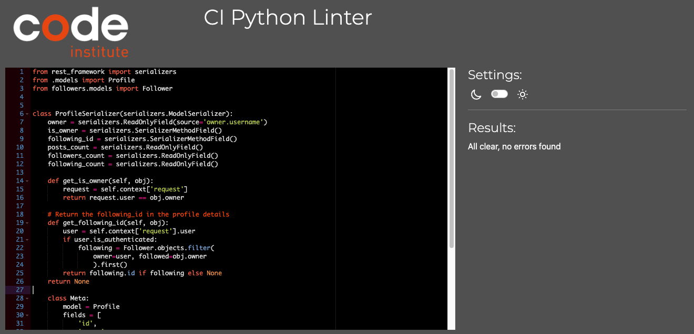
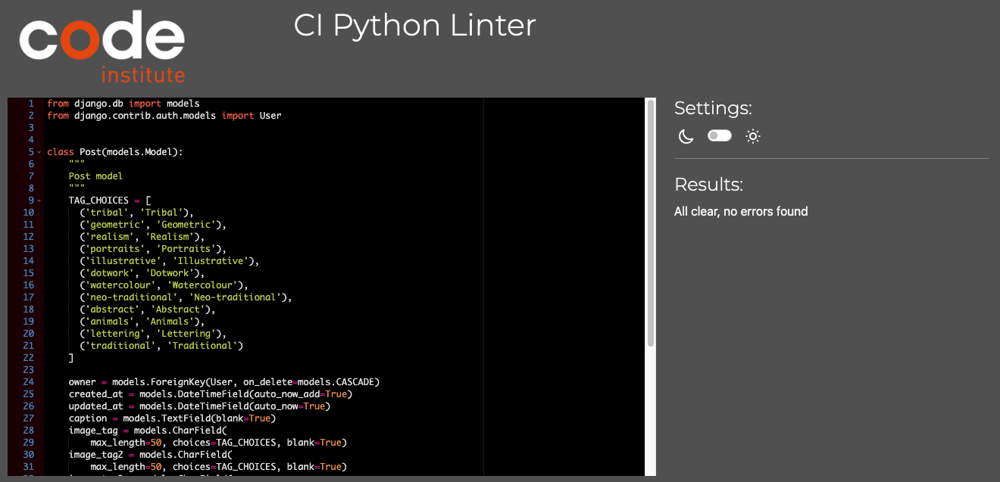

# InkPad API

## TESTING FILE

 

## Contents

### [Testing](#testing-1)
- [Function Testing](#function-testing)
- [User Story Testing](#user-story-testing)
- [Validator Testing](#validator-testing)
- [Unit Testing](#unit-testing)
- [Bugs](#bugs)

 

----

 

## Testing
Testing was performed across a range of devices, including:
- MacBook Air M1
- Nothing Phone (1)
- iPhone 15 Plus

### **Function Testing**

| Function                  | Test                                                                     | Successfully Completed |
| :------------------------ | :----------------------------------------------------------------------- | :--------------------: |
| Login & Register          | Form submits & saves to database                                         |          Yes           |
| Login                     | Registered user can login successfully                                   |          Yes           |
| Logout                    | Registered user can logout                                               |          Yes           |
| Add post                  | Registered user can upload a new post                                    |          Yes           |
| Post                      | Registered user can edit and delete their own posts                      |          Yes           |
| Comment                   | Registered user can add a comment to a post                              |          Yes           |
| Comment                   | Registered user can edit and delete their own comment                    |          Yes           |
| Post                      | Registered user cannot edit or delete another users post                 |          Yes           |
| Comment                   | Registered user cannot edit or delete another users comment              |          Yes           |
| Profile                   | Registered user can view and update their own Profile                    |          Yes           |
| Profile                   | Registered user cannot edit or delete another user profile               |          Yes           |
| Profile                   | Users can view other users' profiles                                     |          Yes           |
| All registered user pages | Registered user can follow and unfollow other users                      |          Yes           |
| Post List                 | Users can keyword search posts                                           |          Yes           |

 

### **User Story Testing**

| User Goal                                                                                      | Solution    | Successfully Implemented? |
| :--------------------------------------------------------------------------------------------- | :--------   | :-----------------------  |
| As a user I can register on the website                                                        | Using django-all-auth user registration has been implemented | Yes |
| As a user I can login using my registration details                                            | Using django-all-auth user login has been implemented | Yes |
| As a registered user I can view my own profile                                                 | ProfileDetail view allows this | Yes |   
| As a user I can edit my profile and profile image so I can keep my profile updated             | ProfileDetail view allows this | Yes |
| As a user I can post images to share my designs with the community                             | Post Serializers enable this functionality | Yes | 
| As a user I can view other posts by registered users so I can look for inspiration             | PostList view allows this | Yes |
| As a user I can favourite other users posts so I can easily refer back to them                 | The Like model enables this functionality | Yes |
| As a user I can follow other users so that I can easily find their new posts                   | FollowerList view allows this | Yes | 
| As a user I can see which followers are following me so that I can reciprocate following       | FollowerList view allows this | Yes | 
| As a user I can filter posts by their tags so I can look for specific types of images          | PostList filters enable this | Yes | 
| As a user I can filter posts by their user so I can see all the posts by one specific user     | PostList filters enable this | Yes | 
| As a user I can search posts with keywords so I can look for specific types of images          | PostList filters and search fields enable this | Yes |
| As a user I can see the most like images so I can keep up to date with what’s trending         | PostList ordering enable this | Yes | 
| As a user I can post comments on other users posts so I can share my thoughts                  | The Comment model enables this functionality | Yes |
| As a user I can view other users comments on my posts and other users posts                    | CommentList view allows this | Yes |
| As a user I can edit my own posts so I can correct any errors                                  | PostDetail enables this functionality | Yes | 
| As a user I can delete my own posts so I can remove any unwanted posts                         | PostDetail enables this functionality | Yes | 
| As a user I can edit my own comments so I can correct any errors                               | CommentDetail enables this functionality | Yes | 
| As a user I can delete my own comments so I can remove any no longer wanted comments I’ve made | CommentDetail enables this functionality | Yes | 
| As a user I can view other users’ profiles so I can see their full posts and follow them       | ProfileList and ProfileDetail views enable this | Yes |
| As a user I can see the most followed profiles so I can see who is trending                    | Profile Serializers enable this functionality | Yes |

 

### **Validator Testing**

All code passed through the [CI Python Linter](https://pep8ci.herokuapp.com/):

Profiles

Posts

Comments

Followers

Likes

 

### **Unit Testing**

Whilst the automated testing in this project is not extensive I recognise the importance of it and intend to deepen my knowledge in this area for future projects.

Automated tests were carried out on the Posts app to ensure functionality of the core function of the api; allowing registered users to post.

### **Bugs**

I encountered a problem with the rendering of the 'image_tag' and 'status' choices on the front-end of the application. 

I had initially hard-coded the options into the relevant model, however I was struggling to fetch these using a resquest to the api. 

Instead I created a seperate endpoint to fetch the choices. This enabled me to debug much more clearly, and also provides better flexibility and scalability. \
Having a seperate endpoint with the choices means options can be added, removed or modified without the need to change the model itself.

I decided to keep the choices within the model as well to ensure default values. I felt this struck a balance between flexibility and data integrity.

 

---